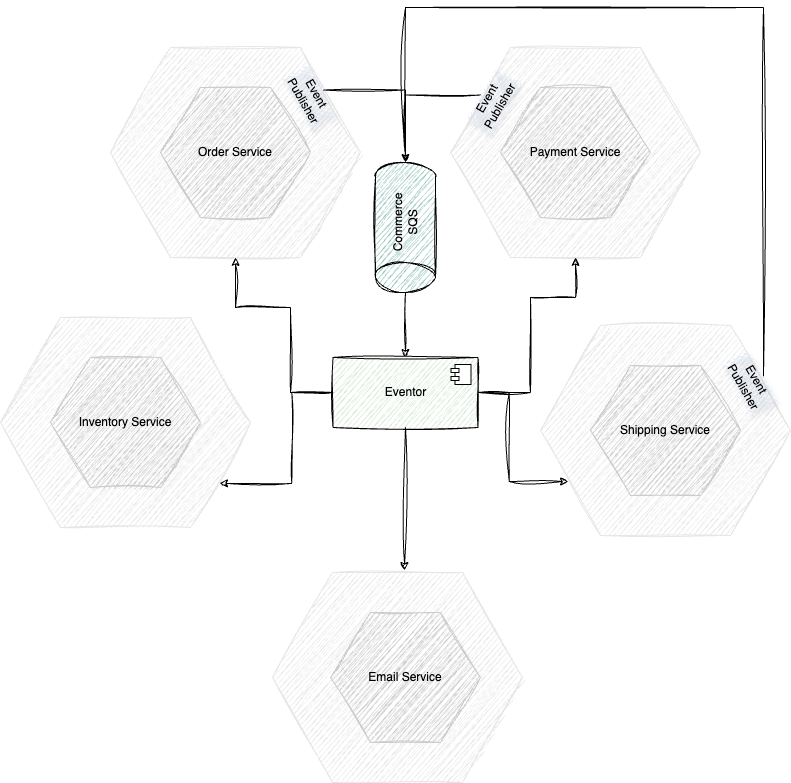

## Description

This project is to showcase how to implement event driven architecture using one AWS SQS.

It is the practical part of the artical [Event Driven Architecture using AWS SQS]()

## Architecture

`Eventor` is the component whose resposibility is to alter the nature of SQS message to the nature of event, which could be consumed by differnt other services through their agents.

Full explanation can be found in the article.

## Run The Services

First Docker desktop needs to be installed.

Then simply run the command `docker compose up` or `docker-compose up` dependign on Docker version.
